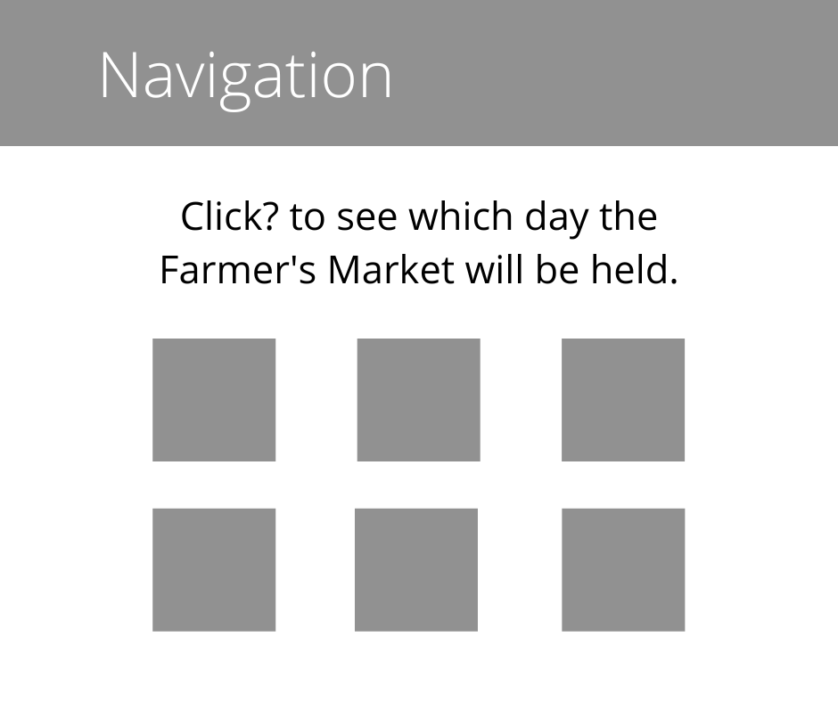

# Chicago Hearts The Earth  
This project serves as a resource to display environment and sustainable development data. Data taken from [The City of Chicago Data Portal](https://data.cityofchicago.org/browse?category=Environment+%26+Sustainable+Development).
## Technologies Used  
* HTML5  
* CSS3  
* JavaScript  
* jQuery  
* AJAX  
## Screenshots  
### Wireframe

### Final Product
.png)  
.png)  
.png)  
## Getting Started  
[click here to view project](https://sage-selkie-3c1f91.netlify.app/)  
## Future Enhancements  
* Build out site to hold more data  
* Add links to resources to help users reduce their environmental impact
* Build about page on the site